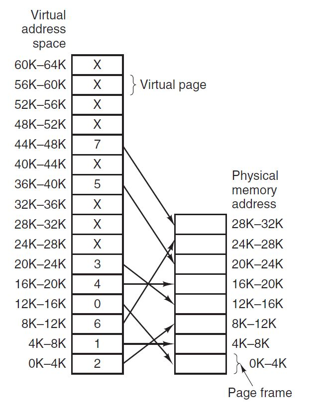

# Assignment 3 - Part 1: Textbook problems

McGill University - ECSE 427: Operating Systems

**Tristan Bouchard, 260747124**

## Question 1: P. 254 #4. 

_Consider a swapping system in which memory consists of the following hole sizes in
memory order: 10 MB, 4 MB, 20 MB, 18 MB, 7 MB, 9 MB, 12 MB, and 15 MB.
Which hole is taken for successive segment requests of_

_(a) 12 MB_

_(b) 10 MB_

_(c) 9 MB_

_for first fit? Now repeat the question for best fit, worst fit, and next fit._

With subsequent requests of the same memory size, here is the order in which each hole is filled based on the management strategy

Memory Request Size| First Fit | Best Fit | Worst Fit | Next Fit 
-------------------|-----------|----------|-----------|---------
a) - 12MB|20MB, 18MB, 12MB, 15MB|12MB, 15MB, 20MB|20MB, 18MB, 15MB|20MB, 18MB, 12MB, 15MB| 
b) - 10MB|10MB, 20MB, 18MB, 12MB, 15MB|10MB, 12MB, 15MB, 18MB, 20MB|20MB, 18MB, 15MB, 12MB|10MB, 20MB, 18MB, 12MB |
c) - 9MB|10MB, 20MB, 18MB, 9MB, 12MB, 15MB|9MB, 10MB, 12Mb, 15MB, 18MB, 20MB|20MB, 18MB, 15MB, 12MB, 10MB, 9MB|10MB, 20MB, 18MB, 9MB, 12MB, 15MB |

## Question 2: P. 254 # 7

_Using the page table of Fig. 3-9, give the physical address corresponding to each of the
following virtual addresses:_

_(a) 20_

_(b) 4100_

_(c) 8300_

Based on figure 3-9 on page 197:

 the physical addresses are:

Virtual Address | Physical Address
----------------|-----------------
a) 20 | 4096 * 2 + 20 = 8212
b) 4100 | 4100
c) 8300 | (4096 * 6) + (8300 - 4096*2) = 24684

## Question 3: P. 257 #28

_If FIFO page replacement is used with four page frames and eight pages, how many
page faults will occur with the reference string 0172327103 if the four frames are initially
empty? Now repeat this problem for LRU._

Assuming RAM structure contains 4 page frames, which are each the size of a page in physical memory
For provided sequence 0172327103 in a system with four page frames and 8 pages:

FIFO: The queue presented in the diagram below is ordered as the first item in is the farthest to the right, sort-of like a shift register from
left to right. The newest item in is appended on the left

Requested Page | Page Frame 0 | Page Frame 1 | Page Frame 2 | Page Frame 3 | FIFO Queue | Page Fault count 
----------|--------------|--------------|--------------|--------------|------------|-----------------
0  | 0 | x | x | x | 0    | 1 
1  | 0 | 1 | x | x | 10   | 2
7  | 0 | 1 | 7 | x | 210  | 3
2  | 0 | 1 | 7 | 2 | 3210 | 4
3  | 3 | 1 | 7 | 2 | 0321 | 5
2  | 3 | 1 | 7 | 2 | 0321 | 5
7  | 3 | 1 | 7 | 2 | 0321 | 5
1  | 3 | 1 | 7 | 2 | 0321 | 5
0  | 3 | 0 | 7 | 2 | 1032 | 6
3  | 3 | 0 | 7 | 2 | 1032 | 6

**There are therefore 6 page faults caused using the FIFO page replacement strategy**

LRU: The LRU list presented in the following table shows the least recently used at the end of the queue, to the far right. When page is used, it is jumped back to the front of the queue.

Requested Page | Page Frame 0 | Page Frame 1 | Page Frame 2 | Page Frame 3 | LRU List | Page Fault count 
----------|--------------|--------------|--------------|--------------|------------|-----------------
0  | 0 | x | x | x | 0    | 1 
1  | 0 | 1 | x | x | 10   | 2
7  | 0 | 1 | 7 | x | 210  | 3
2  | 0 | 1 | 7 | 2 | 3210 | 4
3  | 3 | 1 | 7 | 2 | 0321 | 5
2  | 3 | 1 | 7 | 2 | 3021 | 5
7  | 3 | 1 | 7 | 2 | 2301 | 5
1  | 3 | 1 | 7 | 2 | 2310 | 5
0  | 0 | 1 | 7 | 2 | 2310 | 6
3  | 0 | 3 | 7 | 2 | 0231 | 7

**There are therefore 7 page faults caused using the LRU page replacement strategy**

## Question 4: P. 258 #38
_Fragment A_

    for (int j = 0; j < 64; j++)

        for (int i = 0; i < 64; i++) X[i][j] = 0;

_Fragment B_

    for (int i = 0; i < 64; i++)

        for (int j = 0; j < 64; j++) X[i][j] = 0;

Given that the program used to manipulate the X array fills an entire page, and as such we only have the 3 remaining pages in RAM to store our data. Also, the Array is of size 64 x 64 = 4098 integers, which means 4096 words / 128 (words/pages) = 32 pages to store.

Knowing that the memory is X array is stored in a row major form, meaning that X[0][1] occupies the next memory spot after X[0][0], it is obvious that Framgent A will generate more page faults, due to the fact that the inner loop iterates over the rows of the array. This requires fetching pages from the memory more frequently, as the array rows are farther away than array columns.

Now, for the number of page faults: given that a page contains 128 words and that the array contains 64 rows, each page of the array loaded contains 2 array rows.

Now, for _Fragment A_, this means that there will be a page fault every second time X[i][j] is referenced, which results in 64 (columns) * 64/2(rows) = 2048 page faults.

For _Fragment B_, a page fault is caused every second iteration of the outer loop. This results in 64/2 = 32 page faults.